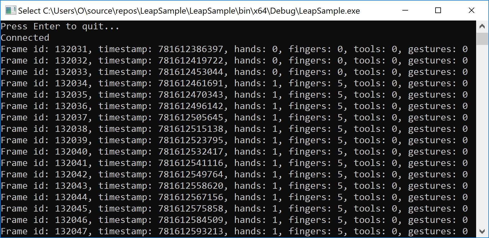

# Leap Motion Sample

A C# console application to get data through [leap motion](https://www.leapmotion.com) controller.

Steps followed;

* Installed [Leap Motion SDK v2.3.1](https://developer.leapmotion.com/sdk/v2)
* Installed [Windows 10 Fall Creators Update Bugfix](https://forums.leapmotion.com/t/resolved-windows-10-fall-creators-update-bugfix/6585)
* Followed [Setting Up a Windows Forms or WPF Project](https://developer-archive.leapmotion.com/documentation/v2/csharp/devguide/Project_Setup.html) to set up the project
* Followed [Hello World](https://developer-archive.leapmotion.com/documentation/v2/csharp/devguide/Sample_Tutorial.html) tutorial

The result;

